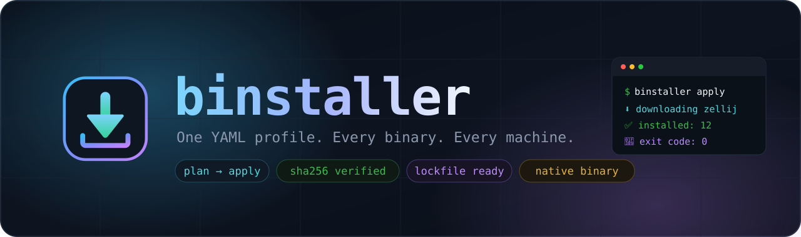
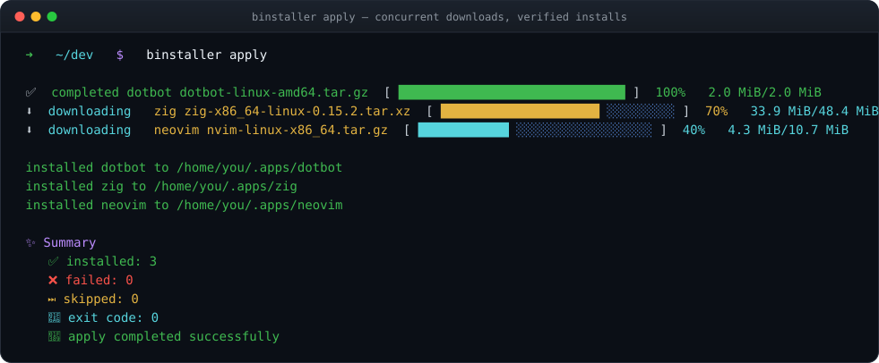
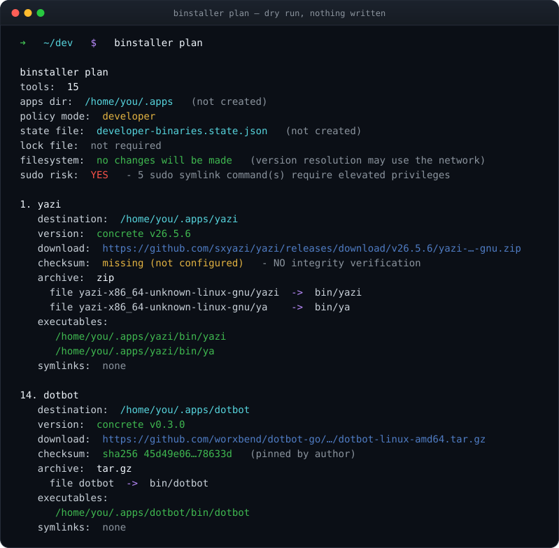
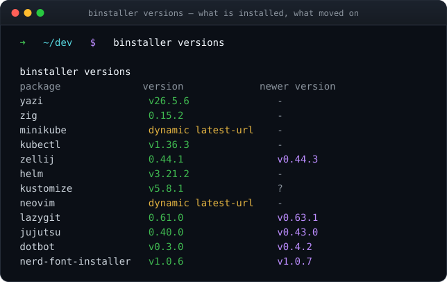

<div align="center">



<br>

**One YAML profile. Every binary. Same result on every machine.**

`binstaller` is a native CLI that installs binary tool distributions from a single declarative profile —
with a dry-run plan you read first, SHA-256 verification you can trust, and a lock file that pins the result.

<br>

[](https://github.com/worxbend/binstaller/actions/workflows/release.yml)
[](https://worxbend.github.io/binstaller/)
[](https://github.com/worxbend/binstaller/releases/latest)


<br>

### 🌐 [**Website**](https://worxbend.github.io/binstaller/) &nbsp;·&nbsp; 📚 [**Wiki**](https://github.com/worxbend/binstaller/wiki) &nbsp;·&nbsp; 📦 [**Releases**](https://github.com/worxbend/binstaller/releases) &nbsp;·&nbsp; 🔐 [**Security model**](docs/security.md)

</div>

<br>

<div align="center">
  
</div>

<br>

---

## ⚡ Install

<div align="center">

```bash
curl --proto '=https' --tlsv1.2 -sSfL \
  https://github.com/worxbend/binstaller/releases/latest/download/install.sh | sh
```

</div>

The script downloads the release tarball, verifies its SHA-256 checksum, additionally verifies the
keyless Sigstore signature when `cosign` is installed, and installs `binstaller` to `~/.local/bin`.

| Knob | Effect |
|---|---|
| `BINSTALLER_INSTALL_DIR` | 📁 Install somewhere other than `~/.local/bin`. |
| `BINSTALLER_VERSION` | 📌 Pin a specific version, e.g. `v0.2.0`. |
| `BINSTALLER_UPDATE_PATH=1` | 🧭 Append the install dir to `~/.bashrc` and `~/.zshrc`. |

> [!NOTE]
> By default nothing in your shell configuration is modified — the script just prints the
> `export PATH=...` line to run.

<details>
<summary><b>📦 Release artifacts</b> — every <code>.tar.gz</code> and the example config ship with a <code>.sha256</code> file</summary>

<br>

- `binstaller-<version>-linux-amd64.tar.gz`
- `binstaller-<version>-linux-arm64.tar.gz`
- `binstaller-<version>-macos-amd64.tar.gz`
- `binstaller-<version>-macos-arm64.tar.gz`
- `config.example.<version>.yaml`
- `install.sh`

</details>

---

## 🚀 Quick Start

**1️⃣ Copy a profile**

```bash
cp config.example.yaml config.yaml
```

**2️⃣ Read the plan — nothing is written**

```bash
binstaller plan
```

<div align="center">
  
</div>

**3️⃣ Apply it**

```bash
binstaller apply
```

**4️⃣ Watch for drift**

```bash
binstaller versions
```

<div align="center">
  
</div>

**Narrow the blast radius** — both flags are repeatable, `--only` is applied first and `--skip` second:

```bash
binstaller plan  --only yazi
binstaller apply --skip neovim
```

**Pin everything to a lock file:**

```bash
binstaller lock --output binstaller.lock.json
binstaller apply --locked --lock-file binstaller.lock.json
```

---

## ✨ Why binstaller

| | | |
|---|---|---|
| 🔍 **Plan before apply**<br>Every version, URL, archive mapping and symlink resolved and printed. Zero filesystem writes. | 🔐 **Checksums, loudly**<br>SHA-256 verified when configured — and a missing checksum is called out in the plan. | 🧊 **Lock files**<br>`lock` writes resolved versions and digests; `apply --locked` refuses to drift. |
| 🛡️ **SSRF-guarded**<br>HTTPS only. Loopback, private and cloud-metadata hosts rejected — on every redirect hop. | ↩️ **Resumable state**<br>State is saved after each tool and keyed to the manifest fingerprint, so re-runs skip what worked. | ⚡ **Native, no JVM**<br>GraalVM native images for Linux and macOS, amd64 and arm64. |
| 📦 **Archives handled**<br>Direct binaries, `zip`, `tar.gz`, `tar.xz` — member paths validated so nothing escapes staging. | 🔗 **Sudo is opt-in**<br>System-wide symlinks need `allowSudoSymlinks` and are flagged `sudo risk` in the plan. | 🧱 **Strict mode**<br>`policy.mode: strict` rejects latest-URLs, missing checksums, sudo symlinks and `tar.xz` fallbacks. |

> [!IMPORTANT]
> The scope is deliberately narrow. `binstaller` is **not** a package manager, a dotfiles runner,
> an installer-script host, a shell-command runner, or a multi-OS provisioner. Manifest `installer:`
> blocks are rejected at load time, on purpose.

---

## 🎛️ CLI Surface

| Command | Purpose | Writes files |
|---|---|:---:|
| 🔍 `plan` | Render the resolved install plan. | ❌ |
| 🚀 `apply` | Download, verify, stage, install, symlink, save state. | ✅ |
| 🆙 `versions` | Print package versions and available GitHub release updates. | ❌ |
| 🧊 `lock` | Resolve and write a JSON lock file. | 🧊 lock file only |

<details>
<summary><b>⚙️ Shared options and exit codes</b></summary>

<br>

**Shared options**

| Flag | Meaning |
|---|---|
| `--config FILE` | Path to the YAML profile. Defaults to `config.yaml` in the current directory. |
| `--state FILE` | Override the profile state file for `apply`. |
| `--reset-state` | Ignore saved execution state and start fresh. |
| `--verbose` | Show additional command diagnostics. |
| `--only TOOL` | Include only a named tool (`plan`, `apply`, `lock`). Repeatable. |
| `--skip TOOL` | Omit a named tool (`plan`, `apply`, `lock`). Repeatable. |

**`plan` and `apply` also accept**

| Flag | Meaning |
|---|---|
| `--locked` | Require a compatible JSON lock file before rendering or applying. |
| `--lock-file FILE` | Path to the JSON lock file used by `--locked`. |

**`apply` also accepts**

| Flag | Meaning |
|---|---|
| `--parallelism N` | Number of tools downloaded and staged concurrently. Default `4`. Must be at least `1`. |

**`lock` also accepts**

| Flag | Meaning |
|---|---|
| `--output FILE` | Lock file to write. Default `binstaller.lock.json`. |

**Exit codes**

| Code | Meaning |
|:---:|---|
| `0` | ✅ Completed successfully, including help and plan. |
| `1` | ❌ Manifest loading/resolution failed, selection invalid, apply failed, or state persistence failed. |
| `2` | ⚠️ Command-line usage error. |

</details>

---

## 📄 The Manifest

One file describes the whole toolchain — reviewable in a pull request, validated before a byte is downloaded.

```yaml
apiVersion: binstaller.io/v1alpha1
kind: BinaryDistributionProfile

spec:
  policy:
    mode: strict                      # 🧱 reject latest-URLs, missing checksums, sudo symlinks
    appsDir: "${HOME}/.apps"
    allowSudoSymlinks: false

  versions:
    lazygit: 0.61.0                   # 📌 pinned
    kubectl:
      resolver:                       # 🌐 resolved at plan time
        type: http-text
        url: https://dl.k8s.io/release/stable.txt

  plan:
    - name: lazygit
      kind: binary-tool
      spec:
        versionRef: lazygit
        installDir: "${appsDir}/lazygit"
        download:
          url: "https://github.com/jesseduffield/lazygit/releases/download/v${version}/lazygit_${version}_Linux_x86_64.tar.gz"
          filename: lazygit.tar.gz
          checksum:                   # 🔐 verified before anything is unpacked
            algorithm: sha256
            value: 45d49e06…78633d
          archive:
            type: tar.gz
            extract:
              files:
                - from: lazygit
                  to: bin/lazygit
        executables:
          - path: bin/lazygit
```

📖 Full field reference: [`docs/manifest-reference.md`](docs/manifest-reference.md) ·
📋 Complete working profile: [`config.example.yaml`](config.example.yaml)

---

## ↩️ State And Resume

`apply` writes state after each per-tool result. State is tied to the profile name and the manifest
fingerprint, so a later apply can skip tools already completed for the same profile.

- 📍 The state path comes from `--state` or `spec.policy.stateFile`.
- 🔒 State paths are current-directory filenames only — absolute, nested and empty paths are rejected.
- 🧊 `plan` never touches state.
- 🔄 Use `--reset-state` to intentionally ignore compatible saved state and retry from the beginning.

---

## 🛠️ Build From Source

**Requirements:** JDK 21+ · GraalVM 21 only for local native images.

```bash
./mill __.compile                          # 🏗️  compile everything
./mill __.test                             # 🧪  run every test module
./mill mill.scalalib.scalafmt/checkFormatAll   # 🎨  formatting gate

./mill app.run plan --config config.example.yaml   # ▶️  run from source
```

Build a native image locally:

```bash
GRAALVM_HOME=/path/to/graalvm ./mill app.nativeImage
```

<details>
<summary><b>🧩 Module graph</b></summary>

<br>

```text
app  ──▶ cli ──▶ core ──▶ config
```

| Module | Responsibility |
|---|---|
| `config` | YAML reading, typed decoding, validation, unsupported-field rejection. |
| `core` | Resolution, downloads, checksums, extraction, staging, symlinks, state, events. |
| `cli` | Picocli parsing, exit codes, colored progress, script-friendly output. |
| `app` | Process entry and exit-code propagation only. |

</details>

---

## 📚 Documentation

| Doc | What's inside |
|---|---|
| 🌐 [**Website**](https://worxbend.github.io/binstaller/) | Feature tour, screenshots and quick start. |
| 📚 [**Wiki**](https://github.com/worxbend/binstaller/wiki) | Getting started, recipes, troubleshooting, FAQ. |
| 🏗️ [Architecture](docs/architecture.md) | Module graph, data flow, event contract. |
| 📄 [Manifest reference](docs/manifest-reference.md) | Profile shape, policy, versions, downloads, archives, symlinks. |
| 🔐 [Security model](docs/security.md) | Trust boundaries, checksums, archive safety, sudo policy, known risks. |
| 🧪 [Testing guide](docs/testing.md) | Project-native checks and test patterns. |
| 🚢 [Release guide](docs/release.md) | Native artifacts, release workflow, smoke checks. |

---

<div align="center">

**Found it useful? ⭐ Star the repo — it genuinely helps.**

[🐛 Report a bug](https://github.com/worxbend/binstaller/issues/new) &nbsp;·&nbsp;
[💡 Request a feature](https://github.com/worxbend/binstaller/issues/new) &nbsp;·&nbsp;
[🌐 Website](https://worxbend.github.io/binstaller/)

<sub>Built with Scala 3, Mill and GraalVM.</sub>

</div>
